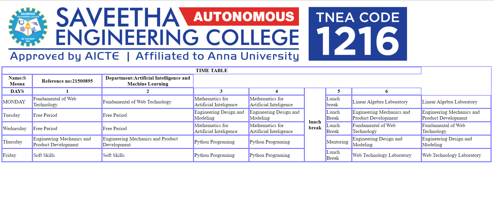

# Experiment_Time_Table

## AIM
To Write a html webpage page to display your timetable.

# ALGORITHM
### STEP 1
create a simple table using table tag
### STEP 2
Add header row using th tag
### STEP 3
Add your timetable
### STEP 4
Execute the program

# CODE
~~~
<!DOCTYPE html>
<html>

   <head>
      <title>TIME TABLE</title>
   </head>
	
   <body>
      <table border = "1" cellspacing="1" bordercolor="blue" bgcolor="white">
      
         <tr>
            <th colspan="8">TIME TABLE</th>
         </tr>
          <th>Name:S Meena</th>
          <th>Reference no:21500895</th>
          <th>Department:Artificial Intelligence and Machine Learning</th>
         <tr>
            <th>DAYS</th>
            <th>1</th>
            <th>2</th>
            <th>3</th>
             <th>4</th>
            <th rowspan="6">lunch break</th>
            <th>5</th>
            <th>6</th>
         </tr>
          <tr>
             <td>MONDAY</td>
             <td>Fundamental of Web Technology</td>
             <td>Fundamental of Web Technology</td>
             <td>Mathematics for Artificial Inteligence</td>
             <td>Mathematics for Artificial Inteligence</td>
             <td>Lunch break</td>
             <td>Linear Algebra Laboratory</td>
             <td>Linear Algebra Laboratory</td>
         </tr>
         <tr>
             <td>Tuesday</td>
             <td>Free Period</td>
             <td>Free Period</td>
             <td>Engineering Design and Modeling</td>
             <td>Engineering Design and Modeling</td>
             <td>Lunch Break</td>
             <td>Engineering Mechanics and Product Development</td>
             <td>Engineering Mechanics and Product Development</td>
         </tr>
         <tr>
             <td>Wednesday</td>
             <td>Free Period</td>
             <td>Free Period</td>
             <td>Mathematics for Artificial Inteligence</td>
             <td>Mathematics for Artificial Inteligence</td>
             <td>Lunch Break</td>
             <td>Fundamental of Web Technology</td>
             <td>Fundamental of Web Technology</td>
         </tr>
         <tr>
             <td>Thursday</td>
             <td>Engineering Mechanics and Product Development</td>
             <td>Engineering Mechanics and Product Development</td>
             <td>Python Programing</td>
             <td>Python Programing</td>
             <td>Mentoring</td>
             <td>Engineering Design and Modeling</td>
             <td>Engineering Design and Modeling</td>
         </tr>
         <tr>
             <td>Friday</td>
             <td>Soft Skills</td>
             <td>Soft Skills<mtd>
             <td>Python Programing</td>
             <td>Python Programing</td>
             <td>Lunch Break</td>
             <td>Web Technology Laboratory</td>
             <td>Web Technology Laboratory</td>
      
         </tr></td>
             
      </table>
      
   </body>
</html>
~~~

# OUTPUT

